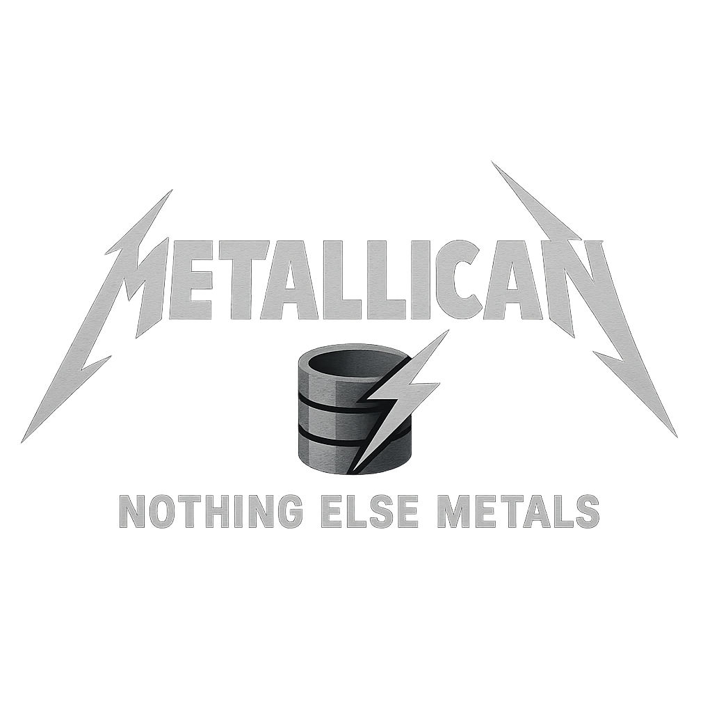

# MetalliCan




This repository contains the code and data associated to create the MetalliCan database, 
a database on metal-related production activities in Canada and their relation to environmental and social impacts. 


# 📊 Input datasets
Due to the large size of certain input datasets, they are not included in this Github repository.
Instead, please refer to the [README.xlsx](README.xlsx) file, which provides a complete list of these datasets, including download instructions, links, and DOIs where available.

Additionally, running the [datasets_processing.ipynb](datasets_processing.ipynb) requires (free) user accounts in Google Earth Engine to authenticate and execute related code.


# 📦 Dependencies
The full list of dependencies is available in the `environment.yml` file. You can create a conda environment with the following command:

```
conda env create -f environment.yml
```

# 📄 License
This repository is licensed under the BSD 3-Clause License. See the LICENSE file for details.


# 📬 Contact
For questions, feel free to open an issue or reach out via email at: [marin.pellan@polymtl.ca](mailto:marin.pellan@polymtl.ca)

# 📄 Citation
Citing the code: Zenodo to come
Citing the article: article currently under review

